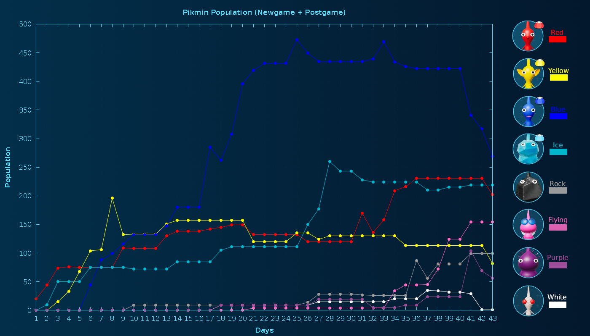

== Pikmin 4 Population Chart Generator

=== Usage

. Install the required dependencies:

[source,bash]
----
sudo apt install -y gnuplot make imagemagick
----

[start=2]
. Update the ``population.tsv`` file with your Pikmin population data (TSV files can be modified with spreadsheet software such as link:https://www.libreoffice.org/download/download-libreoffice/[LibreOffice Calc] or with a text editor).
. Run ``make``.

[source,bash]
----
make
----

If successful, ``population.png`` will be created in the same directory.
